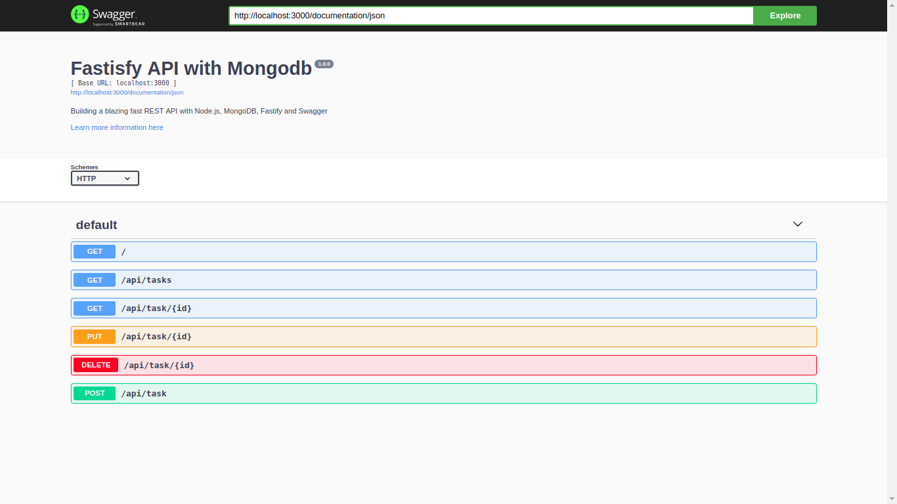

# Todo_Api_fastify_mongodb
TODO API using Fastify with Mongodb for front end developers who dont want any hustle with backend code development  


# Installation local
---- Requirements ----
- Node 8.*
- Npm or yarn
- MongoDB 10.*

Start your mongodb 
```$xslt
$ mongod or sudo mongod
```
Clone the repository to your machine

```
 $ git clone https://github.com/songokjesse/Todo_Api_fastify_mongodb.git
 $ cd to Todo_Api_fastify_mongodb
```

Install dependencies

```$xslt
$ yarn or npm install
```
create .env file
```$xslt
$ cp .example_env .env
```
Add your environment variable

```$xslt
 APP_HOST = {your application host}
 APP_PORT = {your application port}
 
 MONGO_URL = {your mongodb url e.g 'mongodb://localhost:27017/ApiProjects'}
```

Access your Todo api using postman at 
```$xslt
http://{yourhost:yourport}/api/tasks
```

For swagger documentation, access it on

```$xslt
 http://{yourhost:yourport}/documentation
```

# Installation Docker
- Comming Soon

# Testing API 
- Comming Soon

# The Api's screenshot

